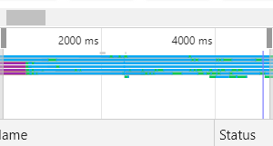
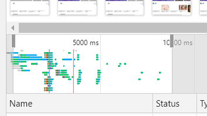
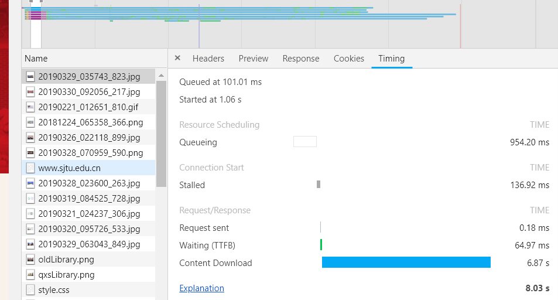
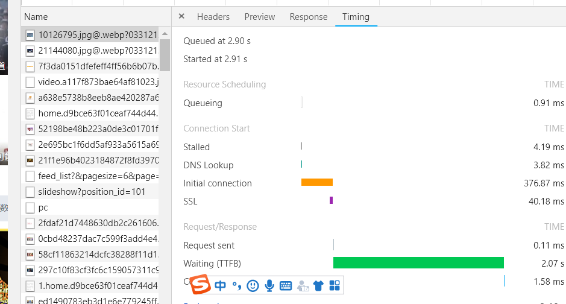
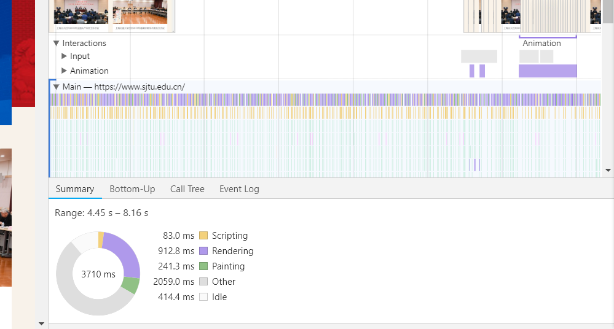
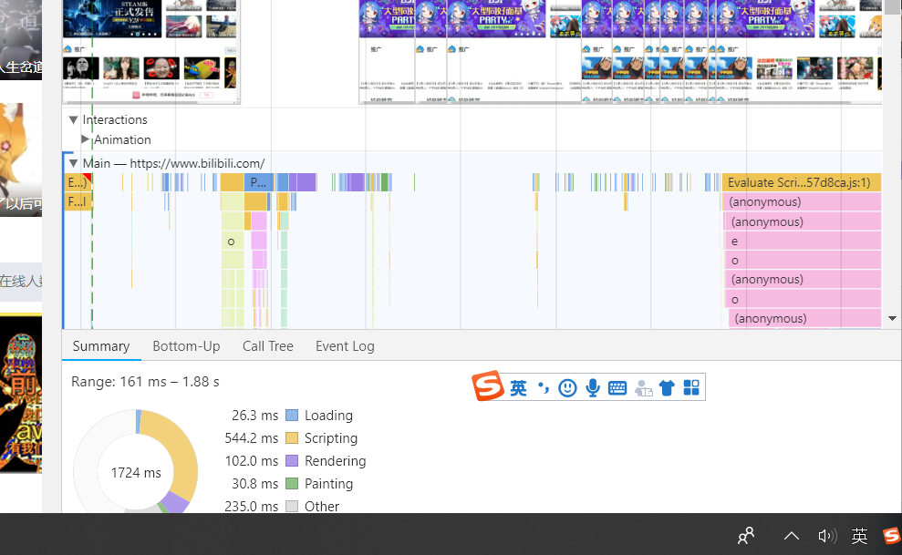

# 浏览器中的F12键的应用
## 简述
F12其实是调用浏览器中的开发者工具的快捷方法。
## 关于开发者工具
其中包含了Elements Console Sources Network
- Elements:可以查看元素的属性。同时可以通过右击这一代码块进行一些调试"Edit as HTML"
- 可以通过进入Style 中对CSS属性进行一些修改
- 可以通过设置Break on属性进行一些调试工作。
- Console可以查看JS对象的一些信息，可以获得js的日常日志。console.log有利于调试的进行。
- https://www.cnblogs.com/yaoyaojing/p/9530728.html
# 关于交大网站的研究
## 通过NetWork进行研究
- 打开交大网站，通过Network查看可以发现交大网站在同一时间加载的资源不是很多，比很多商业网站比如bilibili要少
  > 下图是交大网站的 
  >
  > 
  >下图是bilibili网站的 
  > 
  > 
  >对比不难发现，交大网站单位时间加载资源是远远少于一些商业网站的
- 通过Network不难发现，交大网站的各种资源的加载时间都是远远超过一些商业网站的，尤其是加载图片中的Download Connect时间
  >下图是交大网站的 
  > 
  >下图是bilibili的 
  >
  >可以发现一个交大网站的Connect Download的时间差不多是bilibili的3倍，这样就影响了网站的性能。
## 通过Performance进行研究
- 我发现交大网页在render和painting消耗的性能占了很大的比重
  >下图是关于交大网站的 
  >
  >下图是bilibili的 
  >
  >可以发现交大网站在render和painting上消耗的时间很多，在网站性能中不断的进行render和painting是很浪费资源的。
 # 参考资料
 - [Performance](https://blog.csdn.net/kongduxue/article/details/82017491)
 - [NetWork](https://blog.csdn.net/zengzhenzong/article/details/80446732)
 - [Web页面的性能分析方法](http://www.ruanyifeng.com/blog/2015/09/web-page-performance-in-depth.html）  
