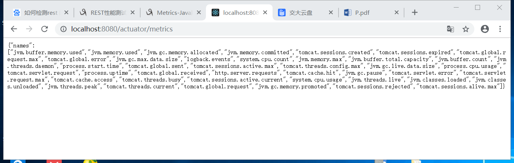
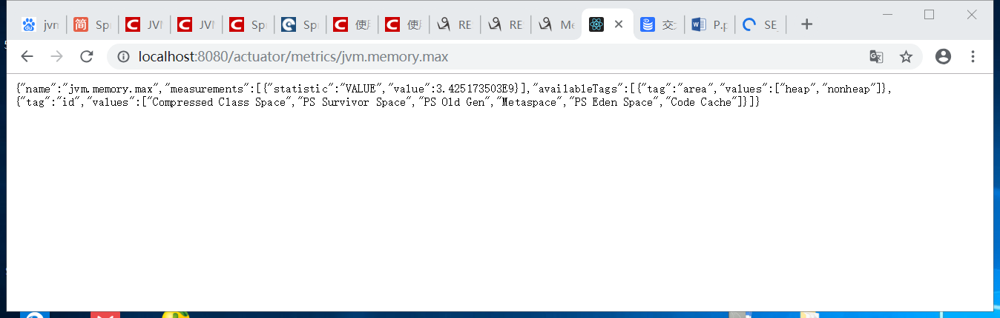
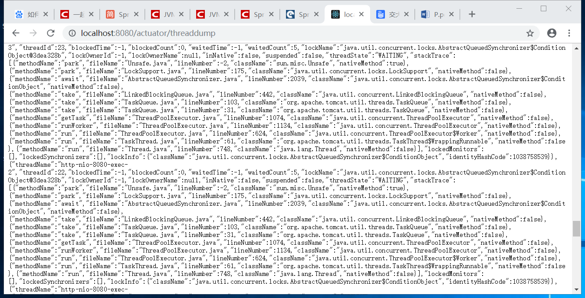
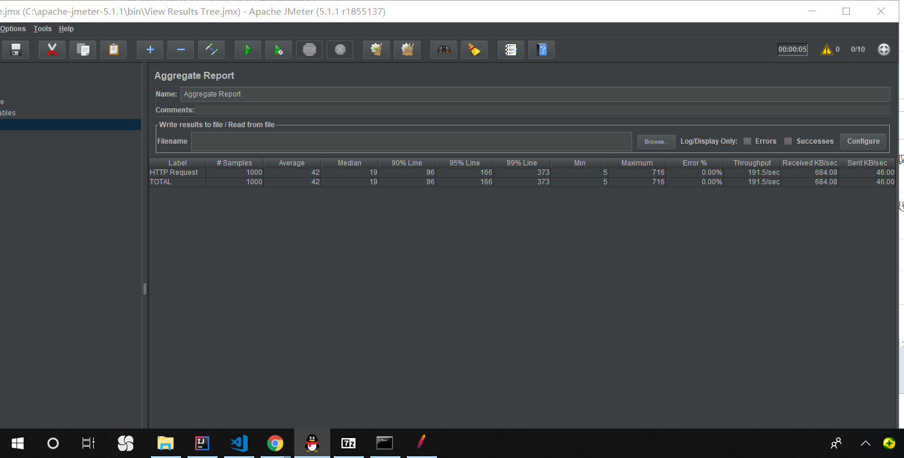

# Task2
## 目标
find the resource consumption of your REST service
## 使用 actuator进行监测
- 在 application.properties 中进行配置，使得我们可以查看actuator的所有端口
- 通过/actuator/metric 进行查看一些有关JVM和Tomcat的重要指标。如下图

- 如果我们需要了解我们rest 应用的jvm的最大内存，我们可以通过访问jvm.memory.max。同理我们可以通过访问jvm.memory.used来了解jvm已用内存等信息。

- 通过一系列参数的了解我可以得到以下的一些resources使用情况:
> 1. jvm的内存使用情况为1.5840312*10^8/3.425173503*10^9 = 4.6%
> 2. rest service 发送的http请求的总数为 18，总时长为0.781105693s，其中最大的时长为0.033313976s.
> 3. 通过访问 /actuator/threaddump可以监测rest service的线程情况。结果如下图。

## 使用Jmeter进行一些性能测试。
- 首先上http://jmeter.apache.org/download_jmeter.cgi 下载安装Jmeter
- 然后打开Jmeter中配置线程组，我们测试的端口号为http://localhost:8080 
- 之后我们 我们设置线程数为10，和循环次数为1000，然后运行我们的Jmeter的测试，最终可以得到以下的聚合报告。

- 我们可知在1000 samples中的平均响应时间为42，最小响应时间为5，最大响应时间为716，吞吐量为191.5/s.